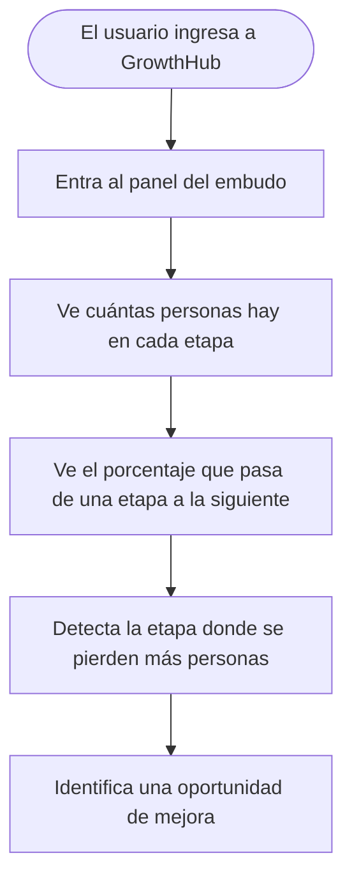
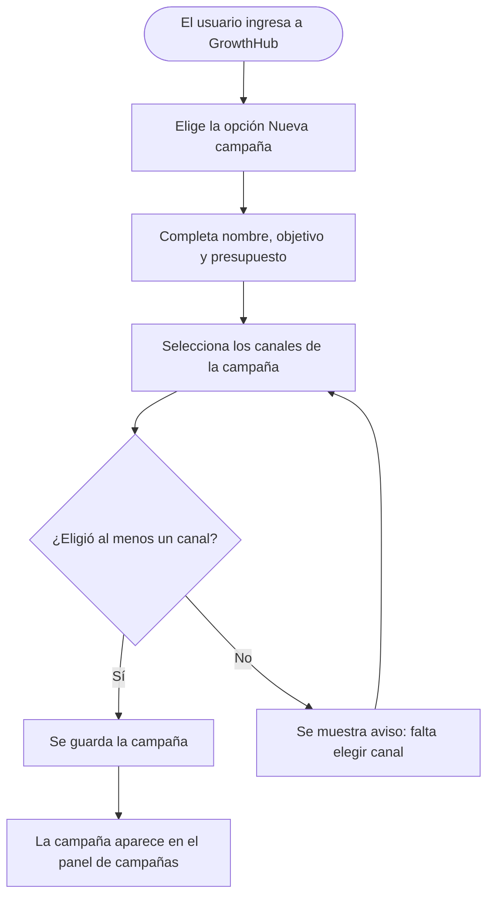
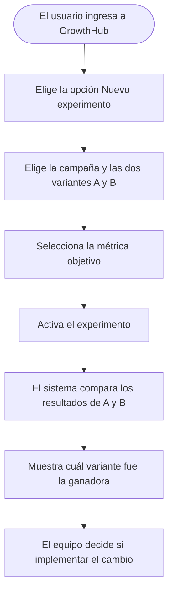

# GrowthMarketing-S08-26-equipo-30
## ANALISIS DE REQUERIMIENTOS DE SOFTWARE

### INTRODUCCIÓN 

El presente documento de Especificacion de Requisitos de Software (SRS)
tiene como propósito definir los requisitos funcionales y no funcionales
de GrowthHub, Una plataforma orientada a equipos de marketing y growth 
que necesitan analizar el comportamiento de los usuarios a lo largo 
de las etapas del proceso de adquisición, activación, conversion y retención.

Este documento servirá como referencia para comprender que debera realizar el sistema,
establecer límites de su alcance y proporcionar una base común para el diseño, desarollo,
validación y evolución de la plataforma.

## Proposito
Growthub proporciona información que permita a los equipos tomar decisiones
de crecimiento basadas en datos, identificar oportunidades de mejora y evaluar
el impacto de sus estrategias y experimentos. 

## Alcance
El sistema permitirá centralizar y consultar información relacionada con usuarios, canales,
campañas, segmentos, etapas del funnel y experimentos de crecimiento, con el objetivo de facilitar
el análisis de adquisición, activación, conversión y retención. 

* Se enfoca en proporcionar herramientas de análisis, seguimiento y medición para equipos de Marketing 
* No se considera dentro del alcance inicial sustituir plataformas externa de publicidad, redes sociales, email marketing o comercio electrónico, sino integrarse o trabajar con informacion proveniente de dichos canales para facilitar su analisis

### en resumen, que esta dentro y que no esta dentro del sistema

| Dentro                  | Fuera                                 |
|:------------------------|:--------------------------------------|
| Analizar campañas       | crear campañas publicitarias externas |
| Ver funnel              | reemplazar Google Ads o Meta Ads      |
| Medir experimentos      | garantizar aumento de ventas          |
| Segmentar usuarios      | Ser un CRM completo                   |
| detectar puntos de fuga | Automatizar todo el marketing         | 
|                         |                                       | 

## Actores del sistema

| Rol                | Responsabilidades                                                              |
|:-------------------|:------------------------------------------------------------------------------|
| Growth Manager     | Define el funnel, aprueba experimentos y revisa métricas globales.              |
| Campaign Manager   | Crea campañas, asigna canales y configura segmentos.                           |
| Analyst            | Consulta métricas, compara campañas e identifica puntos de fuga.               |

## Funnel

El sistema modela el recorrido de cada usuario a través de etapas fijas. Un usuario
avanza automáticamente de una etapa a la siguiente cuando el sistema detecta una acción.

| Etapa       | Significado                                            |
|:------------|:-------------------------------------------------------|
| Visita      | La persona ingresa al sitio o llega por una campaña.    |
| Registro    | La persona crea una cuenta o se registra.               |
| Activación  | La persona completa una acción clave del onboarding.    |
| Interacción | La persona continúa interactuando con la propuesta.     |
| Conversión  | La persona realiza una compra u objetivo.               |
| Retención   | La persona vuelve y mantiene una relación.              |

## Campañas y canales

Una campaña es una iniciativa con objetivo, fechas y presupuesto que puede ejecutarse
en uno o varios canales. Un canal es el medio por el cual se comunica la empresa
(Instagram, Facebook, Google Ads, Email, Referidos, etc.).

| Campaña             | Canales asociados                  | Objetivo      |
|:--------------------|:-----------------------------------|:--------------|
| Lanzamiento verano  | Instagram Ads, Facebook Ads, Google Ads | 500 registros |
| Newsletter bienvenida | Email                            | 100 aperturas |
| Promo referidos     | Referidos, landing page            | 50 conversiones |

## Segmentos

El sistema genera segmentos automáticos combinando la etapa del funnel y el canal de
adquisición del usuario. En versiones futuras se permitirá la creación de segmentos personalizados.

* Usuarios en Registro que vienen de Instagram Ads
* Usuarios en Activación que vienen de Google Ads
* Usuarios Convertidos que vienen de Email
* Usuarios Retenidos que vienen de Referidos

## Experimentos

El sistema permite crear experimentos A/B de campañas, comparando dos variantes para
determinar cuál genera mejores resultados. Al crear un experimento se selecciona la métrica objetivo.

| Métrica objetivo                    | Descripción                                        |
|:------------------------------------|:---------------------------------------------------|
| Tasa de conversión                  | Registros generados sobre visitas.                 |
| Tasa de activación                  | Activaciones sobre registros.                      |
| Tasa de conversión a cliente        | Compras sobre activaciones.                        |
| Costo por resultado                 | Gasto por cada clic, registro o conversión.        |

## Datos y métricas

* El sistema cuenta con datos de demo predefinidos para la presentación.
* Se integra con la API de Meta (Instagram/Facebook) mediante sandbox.
* Métricas consultadas de Meta: alcance, impresiones, clics en enlace, conversiones/registros y costo por resultado.
* La sincronización con Meta es automática cada 15 minutos.

## Casos de uso

A continuación se muestran las acciones principales que cada persona del equipo
puede realizar en GrowthHub, explicadas de forma simple.

### Caso de uso 1: Ver el embudo (funnel)

**Quién lo usa:** Growth Manager y Analyst.

**Para qué sirve:** ver cuántas personas hay en cada etapa del recorrido y en qué
punto se pierden más clientes.

**Qué hace el sistema paso a paso:**

1. La persona entra a la pantalla del embudo.
2. El sistema muestra cuántas personas hay en cada etapa (Visita, Registro, Activación, Interacción, Conversión, Retención).
3. El sistema muestra cuántas personas avanzan de una etapa a la siguiente.
4. Con esa información, la persona puede ver en qué punto se pierden más clientes y dónde conviene mejorar.

---

### Caso de uso 2: Crear una campaña

**Quién lo usa:** Campaign Manager.

**Para qué sirve:** registrar una campaña y elegir los canales donde se va a mostrar,
para después poder comparar resultados.

**Qué hace el sistema paso a paso:**

1. La persona crea una nueva campaña.
2. Completa el nombre, el objetivo y el presupuesto.
3. Elige uno o varios canales (Instagram, Facebook, Google Ads, Email, etc.).
4. Si no eligió ningún canal, el sistema le avisa para que lo complete.
5. Cuando la campaña tiene al menos un canal, se guarda y aparece en el panel de campañas.

---

### Caso de uso 3: Crear un experimento A/B de campañas

**Quién lo usa:** Growth Manager.

**Para qué sirve:** comparar dos versiones de una campaña para saber cuál funciona mejor
antes de aplicarla.

**Qué hace el sistema paso a paso:**

1. La persona crea un nuevo experimento.
2. Elige la campaña y define dos versiones (A y B).
3. Selecciona la métrica con la que se va a comparar (tasa de conversión, tasa de activación, tasa de conversión a cliente o costo por resultado).
4. Activa el experimento.
5. El sistema junta los datos de las dos versiones y muestra cuál fue la ganadora.
6. Con ese resultado, el equipo decide si aplica el cambio ganador.

---

### Caso de uso 4: Consultar un experimento y su resultado

**Quién lo usa:** Analyst.

**Para qué sirve:** ver los experimentos activos, sus hipótesis y cuáles ya tienen un ganador.

**Qué hace el sistema paso a paso:**

1. La persona entra al panel de experimentos.
2. Ve la lista de experimentos activos y terminados.
3. Si elige uno activo, ve las dos variantes y cómo van en la métrica elegida.
4. Si elige uno terminado, ve cuál variante ganó.
5. Así puede comunicar al equipo qué hipótesis fue validada y qué cambio conviene aplicar.

---

  
## Requisitos Funcionales 

|ID         |DESCRIPCION DEL REQUISITO  | DATOS DE ENTRADA | CRITERIOS DE ACEPTACION |
|:----------|:--------------------------|:-----------------|:------------------------|
| RF-001    | El sistema debe permitir registrar y consultar canales de adquisición | Nombre, tipo, costo, fechas | Se puede crear y listar canales con sus datos |
| RF-002    | El sistema debe registrar campañas y asociarlas a uno o varios canales | Nombre, objetivo, presupuesto, fechas, canales | Una campaña se crea con al menos un canal asociado |
| RF-003    | El sistema debe modelar el recorrido de usuarios en etapas fijas del funnel | Usuario, evento, etapa actual | Cada usuario tiene una etapa actual dentro del funnel |
| RF-004    | El sistema debe avanzar automáticamente al usuario de etapa al detectar eventos | Eventos de registro, activación, compra | El usuario cambia de etapa sin intervención manual |
| RF-005    | El sistema debe integrarse con la API de Meta para consultar métricas | Credenciales de sandbox de Meta | Se obtienen alcance, impresiones, clics, conversiones y costo |
| RF-006    | El sistema debe sincronizar automáticamente las métricas de Meta cada 15 minutos | Métricas obtenidas de la API | Los datos se actualizan en el intervalo definido |
| RF-007    | El sistema debe mostrar dashboards de funnel, campañas y experimentos | Datos de usuarios, campañas y experimentos | Cada dashboard muestra la información correspondiente |
| RF-008    | El sistema debe permitir crear experimentos A/B de campañas con métrica objetivo | Campañas variantes A/B, métrica objetivo | Se comparan variantes y se indica la ganadora |
| RF-009    | El sistema debe generar segmentos automáticos por etapa y canal | Etapa del funnel y canal del usuario | Los segmentos se listan y consultan |
| RF-010    | El sistema debe contar con datos de demo predefinidos | Datos de ejemplo cargados | Se visualizan dashboards con datos sin integración real |
| RF-011    | El sistema debe gestionar usuarios con roles y permisos | Usuario, rol, credenciales | Cada rol accede solo a las funciones asignadas |
| RF-012    | El sistema debe detectar puntos de fuga en el funnel | Tasas de conversión entre etapas | Se identifica la etapa con mayor caída |
|           |                           |                  |                         |

 

### Requisitos de la interfaz de usuario

* El sistema se usa desde web de escritorio en navegador.
* Cuenta con dashboards de funnel, campañas y experimentos.
* La interfaz permite navegar entre canales, segmentos y experimentos.

### Requisitos de la interfaz de Hardware

* No se requieren dispositivos de hardware específicos.
* Se accede desde una computadora con navegador moderno.

### Requisitos de la Interfaz de software

* Integración con la API de Meta (Instagram/Facebook) mediante sandbox.
* Interfaz web desarrollada para navegador de escritorio.
* Almacenamiento de datos para el volumen manejado.

### Requisitos de la interfaz de comunicacion 

* Comunicación por HTTPS.
* API REST para la sincronización con Meta.
* Sincronización automática de datos cada 15 minutos.

## Requisitos No funcionales

### Seguridad

* Autenticación de usuarios con usuario y contraseña.
* Roles y permisos por tipo de usuario.
* Encriptación de contraseñas, tokens de API y datos sensibles.
* Cumplimiento de normativas de protección de datos personales.

### Capacidad

* El sistema debe soportar un volumen grande de datos (más de 100.000 registros de contactos).
* Visualización inmediata de los datos disponibles.

### Compatibilidad

* Funciona en web de escritorio sobre navegadores modernos.

### Confiabilidad 

* El sistema debe mantener la disponibilidad de los datos durante la demo.
* La sincronización con Meta debe manejar fallos de conexión sin perder información.

### Escabilidad

* Preparado para crecer en número de usuarios y registros.
* Arquitectura que permita agregar integraciones y dashboards a futuro.

### Mantenibilidad

* Código modular que permita agregar funcionalidades sin afectar las existentes.
* Documentación clara para el equipo de desarrollo.

### Facilidad de Uso

* Interfaz clara para que los equipos de marketing entiendan el recorrido del usuario.
* Dashboards visuales que permitan tomar decisiones sin conocimientos técnicos.

### Otro 

* Datos de demo predefinidos para presentar el sistema sin integración real.
* App móvil contemplada como alcance futuro; el MVP se desarrolla en web de escritorio.

#### Definiciones y acronimos 

* **Canal**: medio por el cual la empresa se comunica con la audiencia (Instagram, Facebook, Google Ads, Email, Referidos, etc.).
* **Campaña**: iniciativa con objetivo, fechas y presupuesto que puede ejecutarse en uno o varios canales.
* **Funnel**: recorrido del usuario por las etapas de Visita, Registro, Activación, Interacción, Conversión y Retención.
* **Segmento**: agrupación de usuarios según la etapa del funnel y el canal de adquisición.
* **Experimento A/B**: comparación de dos variantes de una campaña para determinar cuál genera mejores resultados.
* **Punto de fuga**: etapa del funnel donde se pierde una cantidad significativa de usuarios.
* **Sandbox**: entorno de prueba de la API de Meta para desarrollar la integración sin una cuenta real.
* **Growth**: estrategias orientadas a la adquisición, activación, conversión y retención de usuarios.
* **SRS**: Software Requirements Specification / Especificación de Requisitos de Software.
