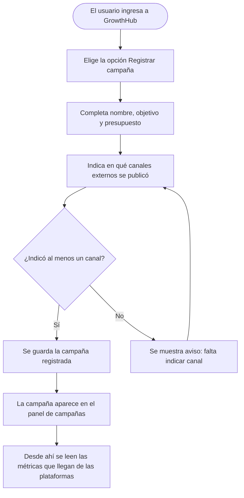
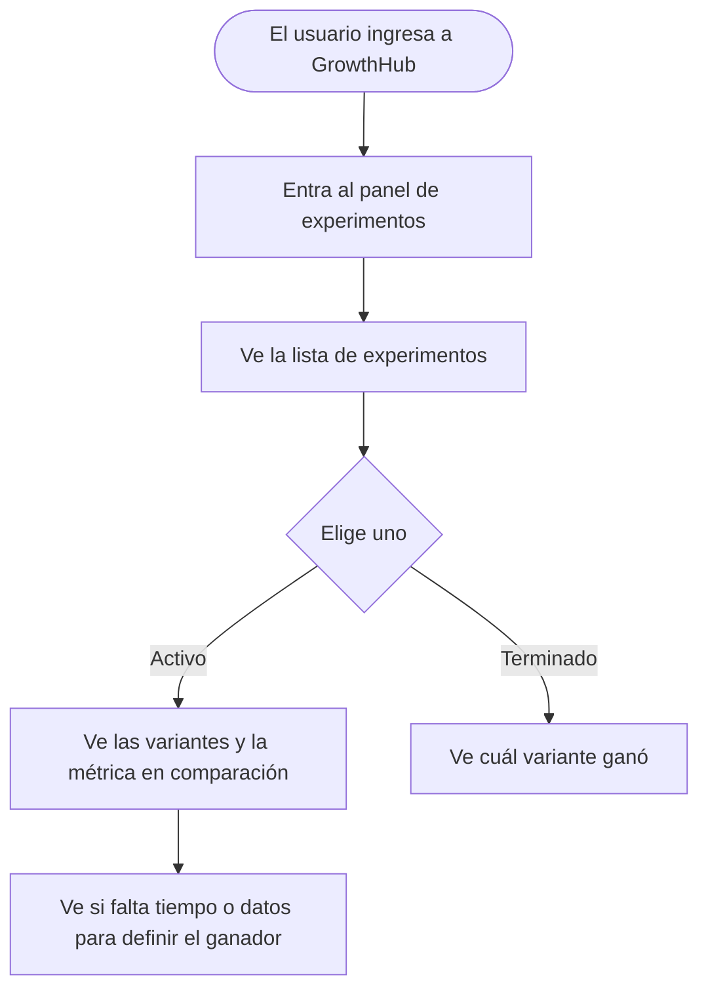

# GrowthMarketing-S08-26-equipo-30
## ANALISIS DE REQUERIMIENTOS DE SOFTWARE

### INTRODUCCIÓN 

El presente documento de Especificacion de Requisitos de Software (SRS)
tiene como propósito definir los requisitos funcionales y no funcionales
de GrowthHub, Una plataforma orientada a equipos de marketing y growth 
que necesitan analizar el comportamiento de los usuarios a lo largo 
de las etapas del proceso de adquisición, activación, conversion y retención.

Este documento servirá como referencia para comprender que debera realizar el sistema,
establecer límites de su alcance y proporcionar una base común para el diseño, desarollo,
validación y evolución de la plataforma.

## Proposito
Growthub proporciona información que permita a los equipos tomar decisiones
de crecimiento basadas en datos, identificar oportunidades de mejora y evaluar
el impacto de sus estrategias y experimentos. 

## Alcance
El sistema permitirá centralizar y consultar información relacionada con usuarios, canales,
campañas, segmentos, etapas del funnel y experimentos de crecimiento, con el objetivo de facilitar
el análisis de adquisición, activación, conversión y retención. 

* Se enfoca en proporcionar herramientas de análisis, seguimiento y medición para equipos de Marketing 
* No se considera dentro del alcance inicial sustituir plataformas externa de publicidad, redes sociales, email marketing o comercio electrónico, sino integrarse o trabajar con informacion proveniente de dichos canales para facilitar su analisis

### en resumen, que esta dentro y que no esta dentro del sistema

| Dentro                          | Fuera                                                       |
|:--------------------------------|:------------------------------------------------------------|
| Registrar y analizar campañas   | Crear campañas publicitarias en plataformas externas        |
| Ver funnel                      | reemplazar Google Ads o Meta Ads                            |
| Medir experimentos              | garantizar aumento de ventas                                |
| Segmentar usuarios              | Ser un CRM completo                                         |
| detectar puntos de fuga         | Automatizar todo el marketing                               |
|                                 |                                                             | 

## Restricciones y supuestos

Estas son las condiciones que limitan el proyecto y las cosas que damos por sentado
para poder entregar el MVP en 3 semanas.

### Restricciones

* El MVP se desarrolla en **web de escritorio**. La app móvil queda para una siguiente etapa.
* La integración real con Meta se hace usando **sandbox**, porque no se cuenta con una cuenta real de empresa para la demo.
* El sistema usa **datos de demo predefinidos** para la presentación, además de lo que se sincronice con Meta.
* Las etapas del funnel son **fijas** en el MVP. Cada empresa usará las mismas etapas.

### Supuestos

* Los usuarios del sistema son personas de marketing con acceso a internet y un navegador moderno.
* El equipo que usa GrowthHub tiene claras las definiciones de campaña, canal, funnel y experimento.
* Para la integración con Meta se contará con credenciales de sandbox disponibles durante el desarrollo.
* Los eventos que hacen avanzar a un usuario de etapa serán enviados o registrados de forma confiable.

## Actores del sistema

| Rol                | Responsabilidades                                                              |
|:-------------------|:------------------------------------------------------------------------------|
| Growth Manager     | Define el funnel, aprueba experimentos y revisa métricas globales.              |
| Campaign Manager   | Registra campañas, asigna canales y configura segmentos.                      |
| Analyst            | Consulta métricas, compara campañas e identifica puntos de fuga.               |

## Funnel

El sistema modela el recorrido de cada usuario a través de etapas fijas. Un usuario
avanza automáticamente de una etapa a la siguiente cuando el sistema detecta una acción.

| Etapa       | Significado                                            |
|:------------|:-------------------------------------------------------|
| Visita      | La persona ingresa al sitio o llega por una campaña.    |
| Registro    | La persona crea una cuenta o se registra.               |
| Activación  | La persona completa una acción clave del onboarding.    |
| Interacción | La persona continúa interactuando con la propuesta.     |
| Conversión  | La persona realiza una compra u objetivo.               |
| Retención   | La persona vuelve y mantiene una relación.              |

## Campañas y canales

Una campaña es una iniciativa con objetivo, fechas y presupuesto que puede ejecutarse
en uno o varios canales. Un canal es el medio por el cual se comunica la empresa
(Instagram, Facebook, Google Ads, Email, Referidos, etc.).

**Importante:** la campaña publicitaria se crea y se publica en la plataforma externa
correspondiente (por ejemplo, Meta Ads o Google Ads). En GrowthHub la campaña solo se
**registra** con sus datos básicos, para poder analizar sus resultados junto al funnel.

| Campaña             | Canales asociados                  | Objetivo      |
|:--------------------|:-----------------------------------|:--------------|
| Lanzamiento verano  | Instagram Ads, Facebook Ads, Google Ads | 500 registros |
| Newsletter bienvenida | Email                            | 100 aperturas |
| Promo referidos     | Referidos, landing page            | 50 conversiones |

## Segmentos

El sistema genera segmentos automáticos combinando la etapa del funnel y el canal de
adquisición del usuario. En versiones futuras se permitirá la creación de segmentos personalizados.

* Usuarios en Registro que vienen de Instagram Ads
* Usuarios en Activación que vienen de Google Ads
* Usuarios Convertidos que vienen de Email
* Usuarios Retenidos que vienen de Referidos

## Experimentos

El sistema permite crear experimentos A/B de campañas, comparando dos variantes para
determinar cuál genera mejores resultados. Al crear un experimento se selecciona la métrica objetivo.

| Métrica objetivo                    | Descripción                                        |
|:------------------------------------|:---------------------------------------------------|
| Tasa de conversión                  | Registros generados sobre visitas.                 |
| Tasa de activación                  | Activaciones sobre registros.                      |
| Tasa de conversión a cliente        | Compras sobre activaciones.                        |
| Costo por resultado                 | Gasto por cada clic, registro o conversión.        |

## Datos y métricas

* El sistema cuenta con datos de demo predefinidos para la presentación.
* Se integra con la API de Meta (Instagram/Facebook) mediante sandbox.
* Métricas consultadas de Meta: alcance, impresiones, clics en enlace, conversiones/registros y costo por resultado.
* La sincronización con Meta es automática cada 15 minutos.

## Reglas de negocio

Estas reglas responden las preguntas frecuentes de uso del sistema, para que el
comportamiento sea predecible y no dependa de interpretaciones.

### Sobre campañas

* El nombre de una campaña debe ser único. Si ya existe una campaña con ese nombre, el sistema avisa y no la guarda.
* No se puede eliminar una campaña que tiene un experimento activo. Primero hay que terminar o cancelar el experimento.
* Una campaña registrada se puede editar, pero su historial de métricas se conserva.

### Sobre experimentos

* Un experimento solo lo puede crear y activar el Growth Manager.
* Antes de activarse, el experimento debe tener: dos variantes, una métrica objetivo y una fecha de inicio.
* Un experimento dura como mínimo 7 días. Antes de ese plazo no se puede declarar un ganador, aunque una variante parezca mejor.
* El ganador se declara solo al finalizar el experimento, según la métrica objetivo elegida al crearlo.
* Si al finalizar no hay una diferencia clara entre las variantes, el experimento se marca como "sin ganador" y se guarda como aprendizaje.
* No se puede editar la métrica objetivo ni las variantes de un experimento activo. Si se necesita cambiar algo, se cancela y se crea uno nuevo.

### Sobre usuarios y segmentos

* Cada usuario tiene una sola etapa actual del funnel. Al completar una acción, avanza automáticamente.
* Los segmentos se generan automáticamente y no se pueden eliminar. Se actualizan cada vez que llegan datos nuevos.
* Un usuario puede aparecer en varios segmentos, porque puede estar en una etapa y haber llegado por un canal determinado.

### Sobre datos

* Si la sincronización con Meta falla, los dashboards siguen mostrando los últimos datos disponibles y se reintenta en el siguiente ciclo.
* Los datos de demo se pueden restablecer a su estado original en cualquier momento, para repetir la presentación.

## Pantallas y su contenido

Esta sección describe qué muestra cada pantalla, quién la usa y en qué situaciones
puede encontrarse (con datos, sin datos, cargando o con error). Es la guía para el
diseño de la interfaz.

### Pantalla 1: Panel del funnel

**Quién la usa:** Growth Manager y Analyst.

**Qué muestra:**

* Las 6 etapas del funnel con la cantidad de usuarios en cada una.
* El porcentaje de usuarios que pasa de una etapa a la siguiente.
* La etapa con mayor caída (punto de fuga), destacada visualmente.
* Los segmentos por canal dentro de cada etapa.
* Filtro por canal y por rango de fechas.

**Estados:**

* *Cargando:* se muestra un indicador mientras llegan los datos.
* *Sin datos:* se muestra un mensaje que explica que aún no hay información y sugiere revisar las campañas registradas.
* *Con error:* se muestran los últimos datos disponibles con un aviso de que la actualización falló.

### Pantalla 2: Panel de campañas

**Quién la usa:** Campaign Manager y Growth Manager.

**Qué muestra:**

* Lista de campañas registradas con nombre, objetivo, presupuesto, fechas y canales.
* Métricas de cada campaña: alcance, impresiones, clics, conversiones y costo por resultado.
* Comparativa entre campañas para ver cuál genera mejores resultados.
* Botón para registrar una campaña nueva.

**Estados:**

* *Cargando:* indicador mientras llegan los datos.
* *Sin datos:* mensaje que invita a registrar la primera campaña.
* *Con error:* se muestran los datos guardados con aviso de fallo de sincronización.

### Pantalla 3: Panel de experimentos

**Quién la usa:** Growth Manager (crea y aprueba) y Analyst (consulta).

**Qué muestra:**

* Lista de experimentos con su estado: borrador, activo, terminado o cancelado.
* Para cada experimento: las variantes A y B, la métrica objetivo y los días transcurridos.
* En experimentos terminados: la variante ganadora o la marca de "sin ganador".
* En experimentos activos: comparación actual de variantes, con aviso de cuántos días faltan para el mínimo de 7 días.

**Estados:**

* *Cargando:* indicador mientras llegan los datos.
* *Sin datos:* mensaje que invita a crear el primer experimento.
* *Con error:* se muestran los datos guardados con aviso de fallo.

### Reglas generales de la interfaz

* Si el usuario no tiene permiso para una acción (por ejemplo, un Analyst intentando crear un experimento), el botón correspondiente no se muestra.
* Los números se muestran redondeados y con formato legible (por ejemplo, 10.000 en vez de 10000).
* Los términos en pantalla son de marketing (campaña, canal, embudo, conversión), no técnicos.
* Toda acción que modifique datos (registrar campaña, activar experimento) muestra una confirmación antes de guardar.

## Casos de uso

A continuación se muestran las acciones principales que cada persona del equipo
puede realizar en GrowthHub, explicadas de forma simple.

### Caso de uso 1: Ver el embudo (funnel)

**Quién lo usa:** Growth Manager y Analyst.

**Para qué sirve:** ver cuántas personas hay en cada etapa del recorrido y en qué
punto se pierden más clientes.

**Qué hace el sistema paso a paso:**

1. La persona entra a la pantalla del embudo.
2. El sistema muestra cuántas personas hay en cada etapa (Visita, Registro, Activación, Interacción, Conversión, Retención).
3. El sistema muestra cuántas personas avanzan de una etapa a la siguiente.
4. Con esa información, la persona puede ver en qué punto se pierden más clientes y dónde conviene mejorar.

---

### Caso de uso 2: Registrar una campaña

**Quién lo usa:** Campaign Manager.

**Para qué sirve:** anotar en GrowthHub los datos de una campaña que ya se publicó en
una plataforma externa (por ejemplo, Meta Ads), para poder analizar sus resultados.
La campaña publicitaria se crea en la plataforma externa, no dentro de GrowthHub.

**Qué hace el sistema paso a paso:**

1. La persona crea la campaña publicitaria en la plataforma externa, como Meta Ads.
2. Luego entra a GrowthHub y registra esa campaña con su nombre, objetivo y presupuesto.
3. Indica en qué canales externos se publicó (Instagram, Facebook, Google Ads, Email, etc.).
4. Si no indicó ningún canal, el sistema le avisa para que lo complete.
5. Cuando la campaña registrada tiene al menos un canal, se guarda y aparece en el panel de campañas.
6. A partir de ese registro, el sistema puede mostrar las métricas que llegan de las plataformas.

---

### Caso de uso 3: Crear un experimento A/B de campañas

**Quién lo usa:** Growth Manager.

**Para qué sirve:** comparar dos versiones de una campaña para saber cuál funciona mejor
antes de aplicarla.

**Qué hace el sistema paso a paso:**

1. La persona crea un nuevo experimento.
2. Elige la campaña y define dos versiones (A y B).
3. Selecciona la métrica con la que se va a comparar (tasa de conversión, tasa de activación, tasa de conversión a cliente o costo por resultado).
4. Activa el experimento.
5. El sistema junta los datos de las dos versiones y muestra cuál fue la ganadora.
6. Con ese resultado, el equipo decide si aplica el cambio ganador.

---

### Caso de uso 4: Consultar un experimento y su resultado

**Quién lo usa:** Analyst.

**Para qué sirve:** ver los experimentos activos, sus hipótesis y cuáles ya tienen un ganador.

**Qué hace el sistema paso a paso:**

1. La persona entra al panel de experimentos.
2. Ve la lista de experimentos activos y terminados.
3. Si elige uno activo, ve las dos variantes y cómo van en la métrica elegida.
4. Si elige uno terminado, ve cuál variante ganó.
5. Así puede comunicar al equipo qué hipótesis fue validada y qué cambio conviene aplicar.

---

## Casos de estudio

Los casos de estudio son ejemplos concretos de cómo un equipo de marketing usaría
GrowthHub en su día a día. Ayudan a entender el valor del sistema en situaciones reales.

### Caso de estudio 1: ¿Dónde perdemos a los clientes?

**Empresa:** una tienda de ropa online.

**Situación:** el equipo invierte en Instagram, Google Ads y email marketing, pero no sabe
en qué punto del recorrido se pierden los clientes. Solo miran cuántas visitas genera cada canal.

**Problema:** Instagram genera muchas visitas, pero muy pocas ventas. El equipo cree que
Instagram es el mejor canal porque trae más gente, y por eso le destina más presupuesto.

**Qué hace el equipo con GrowthHub:**

1. Abren el panel del embudo.
2. Ven que de 10.000 visitas de Instagram solo 1.000 se registran, y de esas solo 50 compran.
3. Comparan con Google Ads: 2.000 visitas, 800 registros y 300 compras.
4. Descubren que el punto de fuga más grande está entre la Visita y el Registro.

**Resultado:** el equipo detecta que Google Ads convierte mejor que Instagram. Deciden
revisar la landing page de Instagram y mover parte del presupuesto a Google Ads.

---

### Caso de estudio 2: Probamos si un mensaje corto funciona mejor

**Empresa:** una app de finanzas personales.

**Situación:** el equipo quiere aumentar la cantidad de personas que se registran después
de ver una campaña en Facebook Ads.

**Problema:** el mensaje actual ("Conoce nuestras funciones") no está convenciendo. No saben
si un mensaje más corto o uno con oferta funcionaría mejor.

**Qué hace el equipo con GrowthHub:**

1. Crean un experimento A/B con dos variantes de la misma campaña en Facebook Ads.
2. Variante A: "Conoce nuestras funciones".
3. Variante B: "Abre tu cuenta gratis en 2 minutos".
4. Eligen como métrica objetivo la tasa de conversión (registros sobre visitas).
5. Al terminar el experimento, el sistema muestra que la variante B ganó.

**Resultado:** el equipo aplica el mensaje ganador a toda la campaña y aumenta la cantidad
de registros, con la certeza de que la decisión se basó en datos y no en una suposición.

---

### Caso de estudio 3: Saber qué canal trae clientes que vuelven

**Empresa:** un servicio de suscripción de comidas.

**Situación:** la empresa quiere retener clientes, no solo conseguirlos.

**Problema:** no saben qué canal trae los clientes más fieles. Piensan que el canal que más
vende es el mejor, pero no conocen cuáles clientes vuelven a comprar.

**Qué hace el equipo con GrowthHub:**

1. Revisan los segmentos automáticos por etapa y canal.
2. Ven que los clientes convertidos por Email tienen una alta retención.
3. Los clientes convertidos por anuncios en redes vuelven menos.

**Resultado:** el equipo decide reforzar la estrategia de email marketing para fidelizar,
entendiendo que no siempre gana el canal que más vende, sino el que trae clientes que regresan.

---

## Criterio de éxito del proyecto

El proyecto será exitoso si un equipo de Marketing-Growth puede ingresar al sistema
y comprender rápidamente:

* De dónde llegan sus usuarios.
* Qué canales generan mejores resultados.
* En qué etapa del funnel se pierden usuarios.
* Qué segmentos tienen mayor conversión.
* Qué campañas generan mejores resultados.
* Qué experimentos están activos.
* Qué hipótesis fueron validadas.
* Dónde existen nuevas oportunidades de crecimiento.

El equipo debería poder recorrer un ciclo completo:

**Detectar una oportunidad → Formular una hipótesis → Diseñar un experimento → Ejecutarlo → Medir resultados → Obtener aprendizaje → Implementar una mejora.**

En términos concretos, el proyecto debería permitir pasar de:

**"Estamos haciendo muchas acciones de marketing, pero no sabemos exactamente cuáles generan crecimiento."**

a:

**"Sabemos dónde estamos perdiendo usuarios, qué hipótesis queremos validar y qué acciones generan un impacto real sobre adquisición, conversión y retención."**

---

## Información que guarda el sistema

Diseño de la base de datos para el **MVP con un único usuario demo**: [base de datos en DBML](docs/base-de-datos-mvp.dbml). Sus nueve tablas cubren campañas y canales, funnel, historial de métricas y experimentos A/B, con soporte para Meta. Los segmentos se calculan desde los eventos. Para esta versión se omiten login y permisos por rol, aunque aparecen en la visión original de este documento. Los nombres siguen el backend y las explicaciones están en español. Los repositorios SQL y las migraciones aún están pendientes.

Esta tabla muestra los datos principales que GrowthHub maneja. No es un modelo
técnico, sino una guía para entender qué información se guarda y cómo se relaciona.

| Elemento    | Información que guarda                                      | Se relaciona con |
|:------------|:------------------------------------------------------------|:-----------------|
| Usuario     | Etapa del funnel, canal por el que llegó, fecha de registro | Campaña, Segmento |
| Canal       | Nombre, tipo, costo, fechas de uso                          | Campaña, Métrica |
| Campaña     | Nombre, objetivo, presupuesto, fechas, canales asociados    | Canal, Experimento |
| Experimento | Variantes A/B, métrica objetivo, fechas, ganador            | Campaña |
| Métrica     | Alcance, impresiones, clics, conversiones, costo            | Canal, Campaña |
| Segmento    | Etapa del funnel + canal de adquisición                     | Usuario |

---

  
## Requisitos Funcionales 

La prioridad indica qué tan indispensable es cada requisito para el MVP:

* **Must**: imprescindible. Sin esto, el sistema no cumple su objetivo.
* **Should**: importante, pero el MVP puede funcionar si se simplifica.
* **Could**: deseable, se incluye si hay tiempo.

|ID         |DESCRIPCION DEL REQUISITO  | DATOS DE ENTRADA | CRITERIOS DE ACEPTACION | PRIORIDAD |
|:----------|:--------------------------|:-----------------|:------------------------|:----------|
| RF-001    | El sistema debe permitir registrar y consultar canales de adquisición | Nombre, tipo, costo, fechas | Se puede crear y listar canales con sus datos | Must |
| RF-002    | El sistema debe registrar campañas y asociarlas a uno o varios canales | Nombre, objetivo, presupuesto, fechas, canales | Una campaña se registra con al menos un canal asociado | Must |
| RF-003    | El sistema debe modelar el recorrido de usuarios en etapas fijas del funnel | Usuario, evento, etapa actual | Cada usuario tiene una etapa actual dentro del funnel | Must |
| RF-004    | El sistema debe avanzar automáticamente al usuario de etapa al detectar eventos | Eventos de registro, activación, compra | El usuario cambia de etapa sin intervención manual | Must |
| RF-005    | El sistema debe integrarse con la API de Meta para consultar métricas | Credenciales de sandbox de Meta | Se obtienen alcance, impresiones, clics, conversiones y costo | Should |
| RF-006    | El sistema debe sincronizar automáticamente las métricas de Meta cada 15 minutos | Métricas obtenidas de la API | Los datos se actualizan en el intervalo definido | Should |
| RF-007    | El sistema debe mostrar dashboards de funnel, campañas y experimentos | Datos de usuarios, campañas y experimentos | Cada dashboard muestra la información correspondiente | Must |
| RF-008    | El sistema debe permitir crear experimentos A/B de campañas con métrica objetivo | Campañas variantes A/B, métrica objetivo | Se comparan variantes y se indica la ganadora | Must |
| RF-009    | El sistema debe generar segmentos automáticos por etapa y canal | Etapa del funnel y canal del usuario | Los segmentos se listan y consultan | Should |
| RF-010    | El sistema debe contar con datos de demo predefinidos | Datos de ejemplo cargados | Se visualizan dashboards con datos sin integración real | Must |
| RF-011    | El sistema debe gestionar usuarios con roles y permisos | Usuario, rol, credenciales | Cada rol accede solo a las funciones asignadas | Must |
| RF-012    | El sistema debe detectar puntos de fuga en el funnel | Tasas de conversión entre etapas | Se identifica la etapa con mayor caída | Should |

 

### Requisitos de la interfaz de usuario

* El sistema se usa desde web de escritorio en navegador.
* Cuenta con dashboards de funnel, campañas y experimentos.
* La interfaz permite navegar entre canales, segmentos y experimentos.

### Requisitos de la interfaz de Hardware

* No se requieren dispositivos de hardware específicos.
* Se accede desde una computadora con navegador moderno.

### Requisitos de la Interfaz de software

* Integración con la API de Meta (Instagram/Facebook) mediante sandbox.
* Interfaz web desarrollada para navegador de escritorio.
* Almacenamiento de datos para el volumen manejado.

### Requisitos de la interfaz de comunicacion 

* Comunicación por HTTPS.
* API REST para la sincronización con Meta.
* Sincronización automática de datos cada 15 minutos.

## Requisitos No funcionales

|ID         |CATEGORIA       |DESCRIPCION DEL REQUISITO  | CRITERIO DE CUMPLIMIENTO |
|:----------|:---------------|:--------------------------|:-------------------------|
| RNF-001   | Seguridad      | Autenticación de usuarios con usuario y contraseña | Solo ingresan usuarios registrados |
| RNF-002   | Seguridad      | Roles y permisos por tipo de usuario | Cada rol accede solo a sus funciones |
| RNF-003   | Seguridad      | Encriptación de contraseñas, tokens de API y datos sensibles | Los datos sensibles no se guardan en texto plano |
| RNF-004   | Seguridad      | Los tokens de la API de Meta se guardan de forma segura | Los tokens no se muestran en pantalla |
| RNF-005   | Seguridad      | Cierre de sesión por inactividad | La sesión se cierra tras 30 minutos sin actividad |
| RNF-006   | Seguridad      | Cumplimiento de normativas de protección de datos | Se respetan las normas de datos personales |
| RNF-007   | Capacidad     | Soporte de un volumen grande de datos | Maneja más de 100.000 registros de contactos sin fallos |
| RNF-008   | Capacidad     | El embudo muestra el resumen sin demoras perceptibles | El dashboard carga en menos de 3 segundos |
| RNF-009   | Capacidad     | Muestra datos de demo y datos de Meta al mismo tiempo | Ambos tipos de datos se visualizan juntos |
| RNF-010   | Compatibilidad | Funciona en web de escritorio | Se usa en Chrome, Edge y Firefox |
| RNF-011   | Compatibilidad | Se ve correctamente en distintas resoluciones | Se ve bien en escritorio y en proyector |
| RNF-012   | Confiabilidad  | Disponibilidad de los datos durante la demo | Los datos se muestran correctamente en toda la presentación |
| RNF-013   | Confiabilidad  | Manejo de fallos de conexión con Meta | Si falla una sincronización, se conserva la última y se reintenta en el siguiente ciclo |
| RNF-014   | Confiabilidad  | Los dashboards funcionan sin conexión a Meta | Muestran los datos guardados aunque Meta no responda |
| RNF-015   | Escabilidad    | Preparado para crecer en usuarios y registros | Admite más usuarios sin cambios de estructura |
| RNF-016   | Escabilidad    | Permite agregar integraciones y dashboards a futuro | Se suman nuevos canales y métricas sin rediseñar |
| RNF-017   | Mantenibilidad | Código modular | Se agregan funciones sin afectar las existentes |
| RNF-018   | Mantenibilidad | Documentación clara para el equipo | El equipo puede mantener y ampliar el sistema |
| RNF-019   | Mantenibilidad | Configuración de conexión a Meta ajustable | Credenciales e intervalo se cambian sin tocar código |
| RNF-020   | Facilidad de Uso | Interfaz clara para equipos de marketing | Se entiende el recorrido del usuario |
| RNF-021   | Facilidad de Uso | Dashboards visuales sin conocimientos técnicos | Se toman decisiones solo mirando los paneles |
| RNF-022   | Facilidad de Uso | Términos de marketing, no técnicos | Se usan palabras como campaña, canal y embudo |
| RNF-023   | Facilidad de Uso | Panel del embudo entendible a primera vista | Un usuario nuevo entiende el embudo en menos de 5 minutos sin explicación técnica |
| RNF-024   | Facilidad de Uso | Cada pantalla muestra su estado actual | Toda pantalla tiene versión de carga, sin datos y con error |
| RNF-025   | Facilidad de Uso | Las acciones sin permiso no se muestran | Un usuario no ve botones que no puede usar |
| RNF-026   | Otro          | Datos de demo predefinidos | El sistema se presenta sin integración real |
| RNF-027   | Otro          | Restablecer datos de demo a su estado original | La demo se puede repetir desde cero |
| RNF-028   | Otro          | App móvil como alcance futuro | El MVP se desarrolla en web de escritorio |

#### Definiciones y acronimos 

* **Canal**: medio por el cual la empresa se comunica con la audiencia (Instagram, Facebook, Google Ads, Email, Referidos, etc.).
* **Campaña**: iniciativa con objetivo, fechas y presupuesto que puede ejecutarse en uno o varios canales. Se crea y se publica en la plataforma externa (Meta Ads, Google Ads, etc.) y en GrowthHub solo se registra para su análisis.
* **Funnel**: recorrido del usuario por las etapas de Visita, Registro, Activación, Interacción, Conversión y Retención.
* **Segmento**: agrupación de usuarios según la etapa del funnel y el canal de adquisición.
* **Experimento A/B**: comparación de dos variantes de una campaña para determinar cuál genera mejores resultados. Dura como mínimo 7 días y el ganador se declara solo al finalizar, según la métrica objetivo elegida.
* **Punto de fuga**: etapa del funnel donde se pierde una cantidad significativa de usuarios.
* **Sandbox**: entorno de prueba de la API de Meta para desarrollar la integración sin una cuenta real.
* **Growth**: estrategias orientadas a la adquisición, activación, conversión y retención de usuarios.
* **SRS**: Software Requirements Specification / Especificación de Requisitos de Software.

## Historial de cambios

| Versión | Fecha       | Cambios realizados |
|:--------|:------------|:-------------------|
| 1.0     | 2026-09-07  | Estructura inicial del SRS con alcance, requisitos funcionales y no funcionales. |
| 1.1     | 2026-09-07  | Se agregaron actores, funnel, campañas, canales, segmentos, experimentos, casos de uso y casos de estudio. |
| 1.2     | 2026-09-07  | Se agregaron restricciones y supuestos, prioridad MoSCoW, modelo de datos simple e historial de cambios. Se hicieron los requisitos no funcionales más medibles. |
| 1.3     | 2026-09-07  | Se corrigió una contradicción de alcance: GrowthHub registra y analiza campañas, pero no crea las campañas publicitarias (eso se hace en plataformas externas). |
| 1.4     | 2026-09-07  | Se agregó la sección de criterio de éxito del proyecto. |
| 1.5     | 2026-09-07  | Se agregaron reglas de negocio (campañas, experimentos, usuarios, datos) y la descripción detallada de pantallas con sus estados (carga, sin datos, error), pensada como guía para el diseño de la interfaz. |
